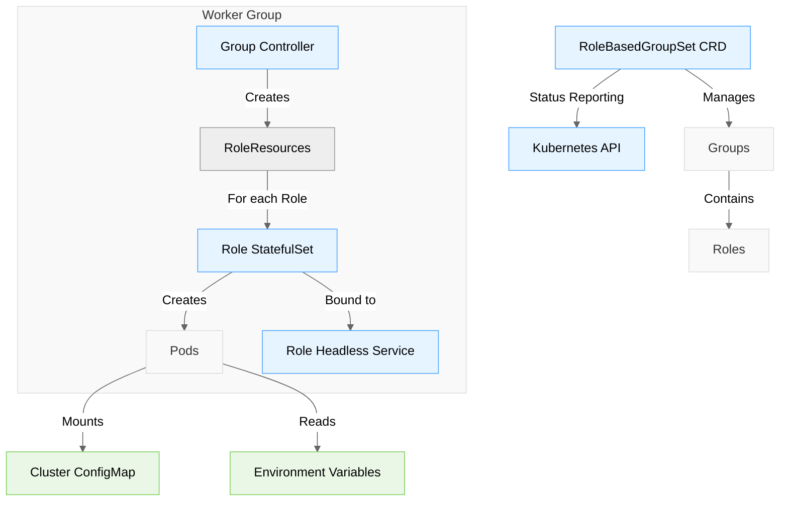
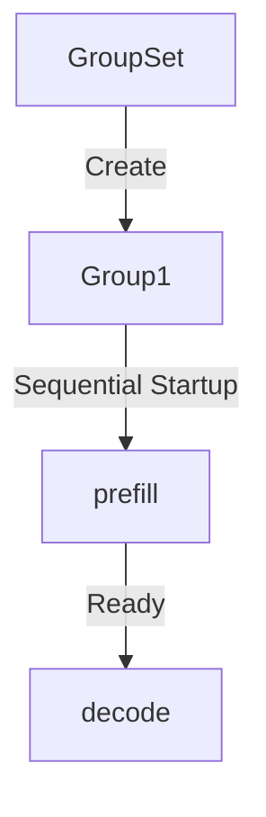

# The RoleBasedGroupSet API 

A Kubernetes operator for orchestrating distributed stateful services with multi-role collaboration and automated service discovery.

## 📖 Overview

### Background
Traditional StatefulSets struggle with multi-role coordination in distributed stateful service scenarios. This solution addresses:
- Startup order dependencies between roles
- Complex cross-role service discovery
- Fragmented configuration management

### Core Capabilities
✨ **Multi-Role Orchestration** - Define role dependencies with ordered/parallel startup  
🔍 **Auto Service Discovery** - Inject topology info via config files and environment variables  
⚡ **Elastic Scaling** - Support group/role-level scaling (future granular scaling)  
📦 **Unified Configuration** - Dual injection via YAML and environment variables

## 🏗 Architecture



**Key Components**:
- `RoleBasedGroupSet CRD`: Custom resource definition for declaring service groups
- `Worker Group`: Isolated unit containing multiple roles
- `Role StatefulSet`: Workload instance for each role
- `Headless Service`: DNS record provider for role instances
- `Config Injection`: Dual configuration through ConfigMap and environment variables

## 🚀 Quick Start

### Install CRD
```bash
kubectl apply -f https://raw.githubusercontent.com/yourorg/rolebasedgroupset/main/config/crd/bases/openpatio.io_rolebasedgroupsets.yaml
```

### Minimal Example
```yaml
apiVersion: openpatio.io/v1alpha1
kind: RoleBasedGroupSet
metadata:
  name: demo-group
spec:
  replicas: 2
  startupPolicy: Ordered
  groupTemplate:
    roles:
      - role: prefill
        replicas: 2
        template: { ... }
      - role: decode
        replicas: 2
        dependencies: ["prefill"]
        template: { ... }
```

## 🧩 Key Features

### Coordinated Role Startup


### Service Discovery Mechanism
Automatically generates two configuration formats:

**1. Config File** (`/etc/rbgs/cluster.yaml`)
```yaml
cluster:
  local:
    role: "decode"
    rank: 0
  roles:
    prefill:
      endpoints:
        - address: "prefill-0.demo-group-prefill:8080"
```

**2. Environment Variables**
```bash
RBGS_ROLES_PREFILL_0_ADDRESS=prefill-0.demo-group-prefill:8080
RBGS_LOCAL_ROLE=decode
```

### Status Management
Real-time status monitoring:
```yaml
status:
  phase: Running
  readyGroups: 2/2
  groups:
    - groupId: "0"
      phase: Running
      roles:
        - role: prefill
          readyReplicas: 2
```

## 🔧 Advanced Configuration

### Cross-Group Communication
Expose roles via Service:
```yaml
apiVersion: v1
kind: Service
metadata:
  name: cross-group-svc
spec:
  selector:
    patio.io/rbgs-role: scheduler
  ports:
    - port: 80
      targetPort: 8080
```

### Role Extension
Add new roles to existing groups:
```yaml
groupTemplate:
  roles:
    - role: postprocess
      replicas: 1
      dependencies: ["decode"]
      template: { ... }
```

## 📚 API Documentation

### Key Fields
| Field | Type | Description |
|-------|------|-------------|
| `startupPolicy` | string | Startup strategy (Ordered/Parallel) |
| `dependencies` | []string | Role dependencies list |
| `workload` | Object | Underlying workload type (default: StatefulSet) |

Full API spec: [API_REFERENCE.md](docs/API_REFERENCE.md)

## 🤝 Contributing
We welcome contributions through issues and PRs! See [CONTRIBUTING.md](CONTRIBUTING.md)

## License
