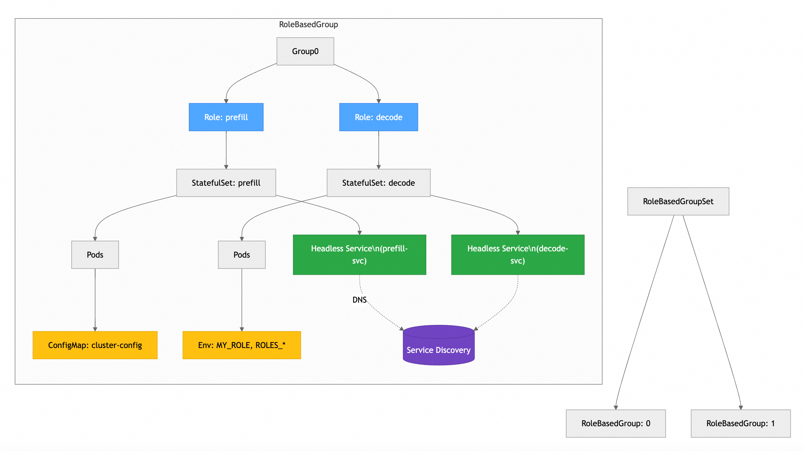

# The RoleBasedGroup API 

RoleBasedGroup: An API for for orchestrating distributed workload services with multi-role collaboration and automated service discovery. It aims to address common deployment patterns of AI/ML inference workloads, especially Prefill/Decode engine disaggregation workloads (e.g. a prefill, decode, scheduler, etc.) where the LLM will be sharded and run across multiple devices on multiple nodes. 

## 📖 Overview

### Background
Traditional Kubernetes statefulset struggle with multi-role coordination in distributed stateful service scenarios. This solution addresses:
- Startup order dependencies between roles  
- Complex cross-role service discovery  
- Fragmented configuration management  

### 🧩 Key Features
   ✨ **Multi-template Role Specification** - Model a distributed stateful workload as a group of K8s Workloads.  
   **Multi-Role Startup Sequencing** - Define role dependencies a startup order for the ReplicatedJobs in a RoleBasedGroup.       
   🔍 **Auto Service Discovery** - Inject topology info via config files and environment variables  
   ⚡ **Elastic Scaling** - Support group/role-level scaling  
     **Rollout and Rolling update** -  It will be performed at the group level, which means we upgrade the groups one by one as a unit (i.e. the pods within a group are updated together).
     **Topology-aware placement** - Be able to ensure that pods in the same group will be co-located in the same topology.
     **All-or-nothing restart for failure handling** - Some ML inference stacksrequire all pods in the group to be recreated if one pod in the group failed or one container in the pods is restarted.


## 🏗 Conceptual Diagram



## 🚀 Quick Start

### Install CRD
```bash
kubectl apply -f rolebasedgroupsets.yaml
```

### Minimal Example
```yaml
apiVersion: openpatio.io/v1alpha1
kind: RoleBasedGroupSet
metadata:
  name: demo-group
spec:
  replicas: 2
  groupTemplate:
    roles:
      - role: prefill
        replicas: 2
        template: { ... }
      - role: decode
        replicas: 2
        dependencies: ["prefill"]
        template: { ... }
```


## 📚 API Documentation

### Key Fields
| Field | Type | Description |
|-------|------|-------------|
| `startupPolicy` | string | Startup strategy (Ordered/Parallel) |
| `dependencies` | []string | Role dependencies list |
| `workload` | Object | Underlying workload type (default: StatefulSet) |

Full API spec: [API_REFERENCE.md](docs/API_REFERENCE.md)

## 🤝 Contributing
We welcome contributions through issues and PRs! See [CONTRIBUTING.md](CONTRIBUTING.md)

## Community, discussion, contribution, and support

Learn how to engage with the Kubernetes community on the [community page]().

You can reach the maintainers of this project at:

- [Slack]()
- [Mailing List]()

### Code of conduct

Participation in the Kubernetes community is governed by the [Kubernetes Code of Conduct](code-of-conduct.md).
