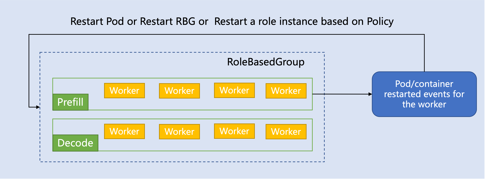

# Failure Handling

RBG support multi failure handling polices: [None | RecreateRBGOnPodRestart | RecreateRoleInstanceOnPodRestart]

## Examples

- [Failure Handling](../../examples/base/restart-policy.yaml)