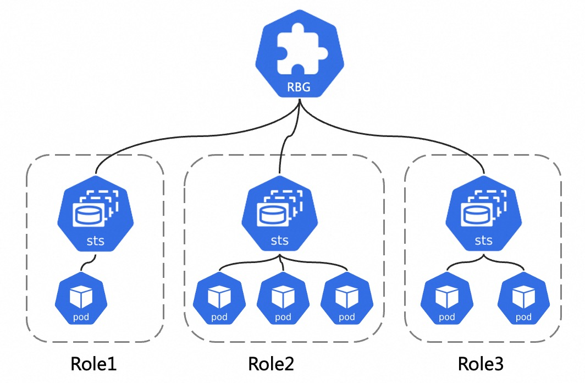
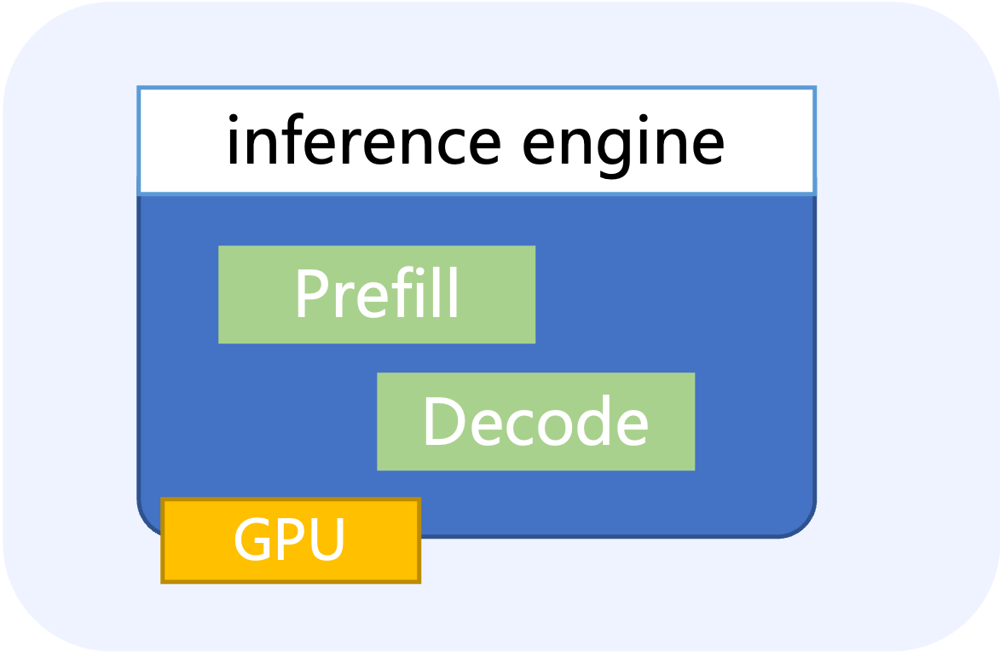
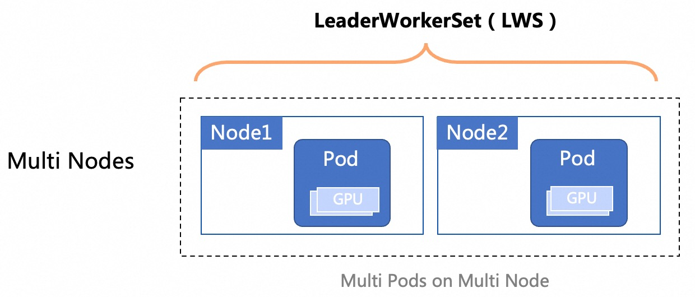
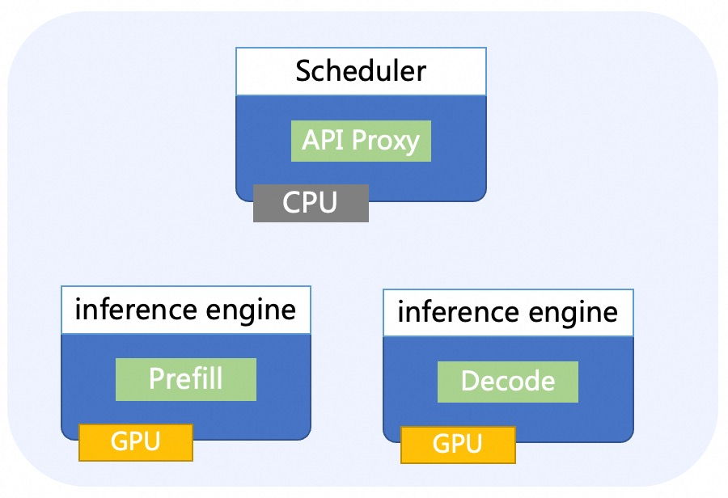
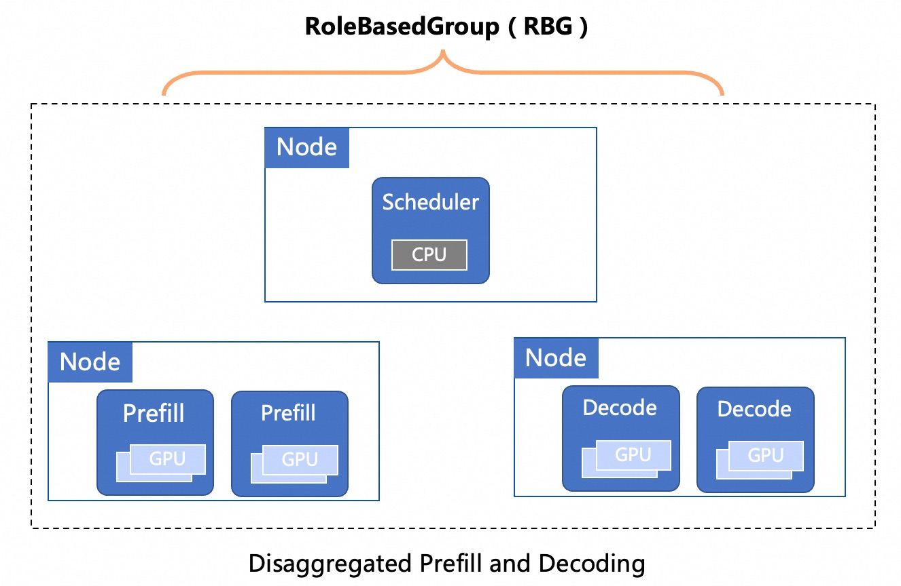

# Quick Start

RoleBasedGroup (RBG) is a custom resource that models a group of roles (each role represents a workload type and set of
pods) and the relationships between them. It is intended to manage multi-role applications that may require coordinated
scheduling, lifecycle management, rolling updates, and optional gang-scheduling (PodGroup) support.

## Conceptual View

## Key Feature

- [Multi Roles](features/multiroles.md)
- [Autoscaling](features/autoscaler.md)
- [Update Strategy](features/update-strategy.md)
- [Failure Handling](features/failure-handling.md)
- [Gang Scheduling](features/gang-scheduling.md)
- [Monitoring](features/monitoring.md)

## PD Colocation

When a request comes into an LLM inference engine, the system will first take the user input to generate the first
token (**prefill**), then generate outputs token-by-token autoregressively (**decode**). A request usually consists of
one prefill step, and multiple decoding steps until termination.

### Single Node

When the model is small enough that a single Kubernetes Node can load all model files, you can deploy the LLM inference
service on a single node.  

#### Examples

- [SGLang](../examples/single-node/sglang.yaml)
- [Others](../examples/single-node/vllm.yaml)

### Multi Nodes

When the model is too large for a single Node to load all files, use multi-node distributed inference.

#### Examples

- [SGLang](../examples/multi-nodes/sglang.yaml)
- [Others](../examples/multi-nodes/vllm.yaml)

## PD Disaggregated

Colocating the two phases and batch the computation of prefill and decoding across all users and requests not only leads
to strong prefill-decoding interferences but also couples the resource allocation and parallelism plans for both phases.
Disaggregating the prefill and decoding computation improves the performance of large language models(LLMs) serving.

### Examples

Deploying PD-disagg inference service with RBG.

- [SGLang PD-Disagg](../examples/pd-disagg/sglang/sgl.md)
- [Others](../examples/pd-disagg/dynamo/README.md)

