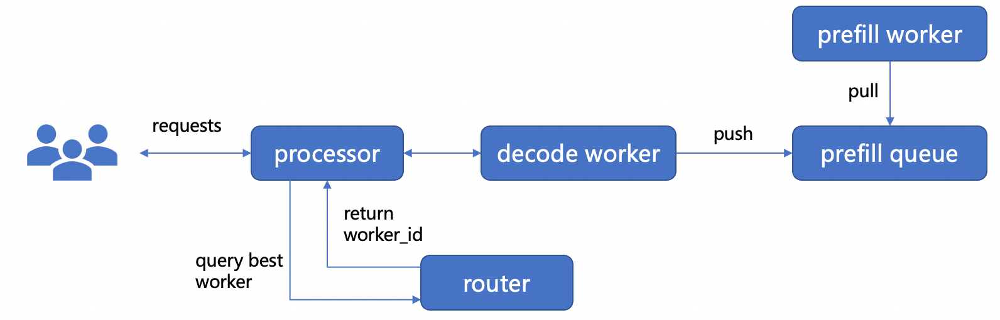

# Prefill-Decode-Disaggregating Inference

The sequence diagram for Dynamo PD separation is as follows. A user request is first sent to the processor component;
the router selects an appropriate Decode Worker and forwards the request to it. The Decode Worker determines whether the
prefill computation should be performed locally or remotely. If remote computation is required, it sends a request to
the PrefillQueue. A PrefillWorker pulls the request from the queue and performs the prefill computation; once complete,
it transfers the Prefill KVCache back to the Decode Worker.



## Prerequisites

1. A Kubernetes cluster with version >= 1.26 is Required, or it will behave unexpected.
2. Kubernetes cluster has at least 3+ CPUs with at least 16G VRAM available for the LLM Inference to run on.
3. The kubectl command-line tool has communication with your cluster. Learn how
   to [install the Kubernetes tools](https://kubernetes.io/docs/tasks/tools/).

## Deploy Dynamo Inference Service

1. Install dependencies
    1. Deploy etcd service
   ```bash
   kubectl apply -f ./etcd.yaml
    ```
    2. Deploy NATS service
   ```bash
   kubectl apply -f ./nats.yaml
    ```

2. Deploy PD Disaggregation with Dynamo-SGLang
   

```bash
kubectl apply -f ./dynamo.yaml
```

4. Verify the inference service

```bash
kubectl port-forward svc/dynamo-service 8000:8000

curl localhost:8000/v1/chat/completions \
  -H "Content-Type: application/json" \
  -d '{
    "model": "qwen3",
    "messages": [
    {
        "role": "user",
        "content": "Explain why Roger Federer is considered one of the greatest tennis players of all time"
    }
    ],
    "stream": false,
    "max_tokens": 30
  }'
```

Expected output:

```text
{"id":"chatcmpl-db2f7465-cafe-4428-bce1-7931ae2960af","choices":[{"index":0,"message":{"content":"<think>\nOkay, the user wants to know why Roger Federer is considered one of the greatest tennis players of all time. Let me start by","role":"assistant","reasoning_content":null},"finish_reason":"length"}],"created":1756801538,"model":"qwen3","object":"chat.completion","usage":{"prompt_tokens":25,"completion_tokens":29,"total_tokens":54}}
```
