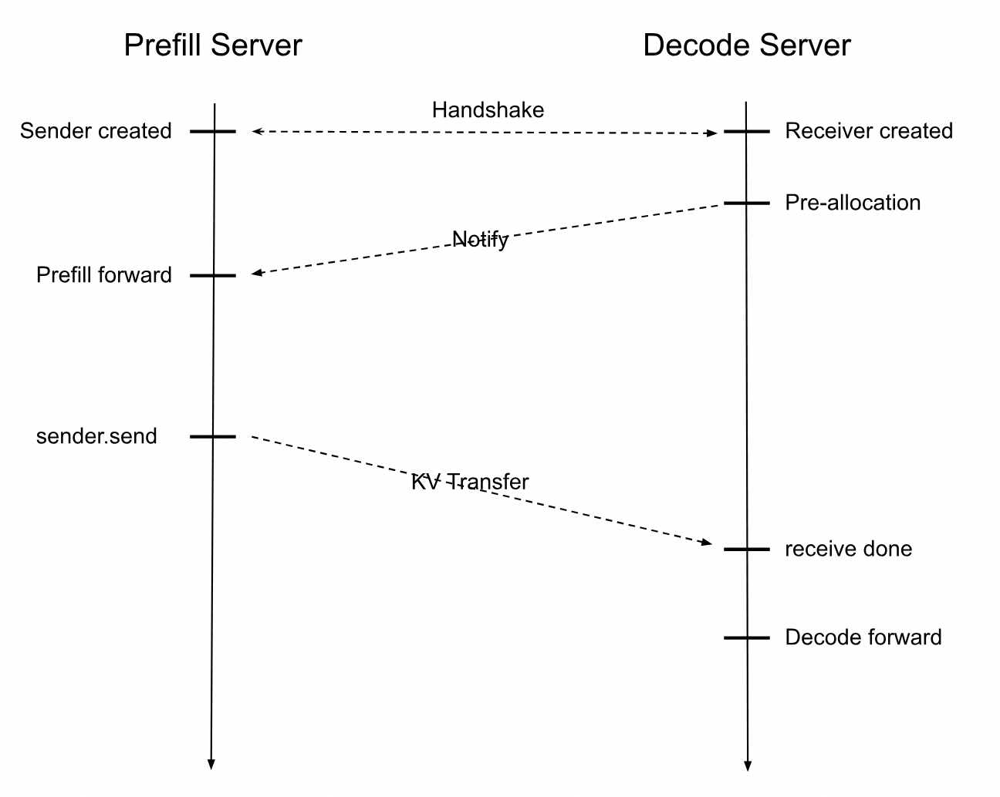
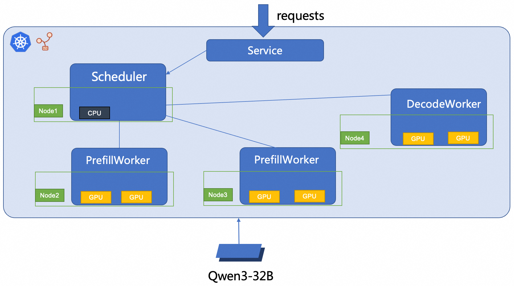

# SGLang Prefill-Decode-Disaggregating Inference



## Prerequisites

1. A Kubernetes cluster with version >= 1.26 is Required, or it will behave unexpected.
2. Kubernetes cluster has at least 6+ CPUs with at least 32G VRAM available for the LLM Inference to run on.
3. Nodes are required to have RDMA networking capabilities. This is a requirement from Mooncake.
4. The kubectl command-line tool has communication with your cluster. Learn how
   to [install the Kubernetes tools](https://kubernetes.io/docs/tasks/tools/).
5. Prepare the Qwen3-32B model files
    1. Run the following command to download the Qwen3-32B model from ModelScope:
   ```shell
   git lfs install
   GIT_LFS_SKIP_SMUDGE=1 git clone git clone https://www.modelscope.cn/Qwen/Qwen3-32B.git
   cd Qwen3-32B/
   git lfs pull
   ```
    2. Create an Object Storage Service (OSS) directory and upload the model files to the directory.
   ```shell
   ossutil mkdir oss://<your-bucket-name>/models/Qwen3-32B
   ossutil cp -r ./Qwen3-32B oss://<your-bucket-name>/models/Qwen3-32B
   ```
    3. Create a persistent volume (PV) and a persistent volume claim (PVC). Create a PV named llm-model and a PVC in the
       cluster.
   ```shell
   # replace OSS variables in model.yaml
   kubectl apply -f model.yaml
   ```

## Deploy SGLang Inference Service

1. Deploy PD Disaggregation Service
   

```bash
kubectl apply -f ./sglang-pd.yaml
```

2. Verify the inference service

```bash
kubectl port-forward svc/sglang-pd 8000:8000

curl http://localhost:8000/v1/chat/completions -H "Content-Type: application/json"  -d '{"model": "/models/Qwen3-32B", "messages": [{"role": "user", "content": "Send a test!"}], "max_tokens": 30, "temperature": 0.7, "top_p": 0.9, "seed": 10}'
```

Expected output:

```text
{"id":"d8645f3a24b1464d96f1787efa5107f1","object":"chat.completion","created":1756813058,"model":"/models/Qwen3-32B","choices":[{"index":0,"message":{"role":"assistant","content":"<think>\nOkay, the user said \"Send a test!\" I need to figure out what they want. Maybe they want me to send a test email","reasoning_content":null,"tool_calls":null},"logprobs":null,"finish_reason":"length","matched_stop":null}],"usage":{"prompt_tokens":12,"total_tokens":42,"completion_tokens":30,"prompt_tokens_details":null}}```
```